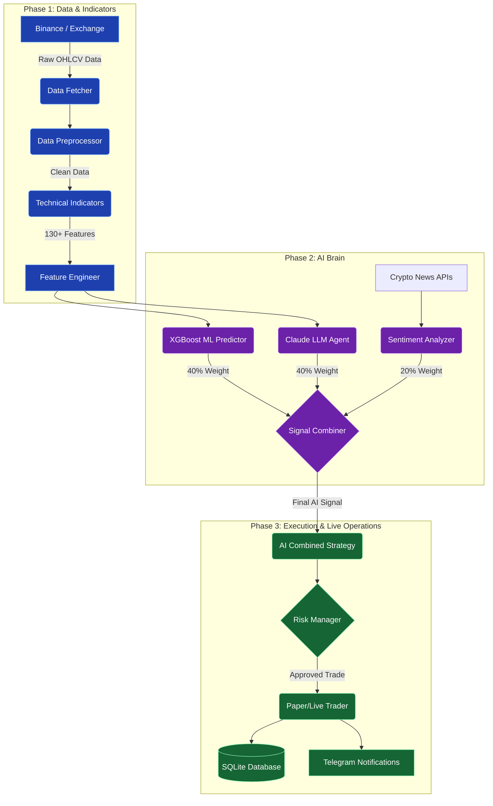

# 🧠 NeuronTrade: Deep Dive Architecture & Workflow

To truly master NeuronTrade, you need to understand how data flows through the system. Think of the bot as a **living organism**: it has eyes (Data Fetcher), a nervous system (Preprocessor & Indicators), a brain (AI Combiner), and hands (Execution Layer).

Here is the deep dive into how NeuronTrade operates "the smart way."

---

## 1. High-Level Architecture Diagram

This diagram shows the complete lifecycle of a single trading decision.

---

## 2. The Step-by-Step Workflow (How a Tick Works)

Imagine the bot is running live on the `1h` (1-hour) timeframe. Here is exactly what happens the second a new 1-hour candle closes (e.g., at 2:00 PM):

### Step 1: Ingestion (The Eyes)
1. The **Data Fetcher** (`data/fetcher.py`) connects to Binance and pulls the latest 1,000 candles.
2. The **Preprocessor** (`data/preprocessor.py`) cleans the data, removes duplicates, fills missing gaps, and calculates basic price action metrics (wicks, candle body size).

### Step 2: Contextualization (The Nervous System)
3. The **Technical Indicators** module (`indicators/technical.py`) takes the clean data and calculates over 130 indicators: RSI, MACD, Bollinger Bands, ATR, Supertrend, etc.
4. The **Feature Engineer** (`indicators/features.py`) prepares this data for the Machine Learning models (adding lags, rolling averages, and cyclical time encodings).

### Step 3: Analysis (The Brain - 3 Parallel Thoughts)
5. **Thought A (The ML Quant):** The `MLPredictor` looks at the 130+ features and runs them through the trained XGBoost model to get a mathematical probability of the price going UP or DOWN.
6. **Thought B (The Analyst):** The `LLMAgent` bundles the current price, RSI, MACD, and trend data into a prompt and sends it to **Claude**. Claude reads the prompt, reasons about the market structure, and returns a JSON response with a signal.
7. **Thought C (The News Reader):** The `SentimentAnalyzer` scrapes the latest crypto headlines, runs them through the local VADER NLP engine (using our custom crypto dictionary), and measures if the market is fearful or greedy.

### Step 4: Fusion (The Decision)
8. The **Signal Combiner** (`ai/signal_combiner.py`) receives all three thoughts. It applies the "Smart Formula":
   * **(Claude × 0.40) + (XGBoost × 0.40) + (Sentiment × 0.20)**
9. It calculates the final score (between -1.0 and +1.0) and a **Confidence level**. If the score is a BUY, but confidence is below 60%, the bot rejects it and holds.

### Step 5: Execution (The Hands)
*(Note: We will build this in Phase 3)*
10. The **Strategy** (`strategies/ai_combined.py`) passes the final BUY/SELL signal to the **Risk Manager**.
11. The Risk Manager checks if you have enough Capital, calculates the exact Position Size based on your Risk % (e.g., risk only 2% per trade), and sets the Stop Loss and Take Profit levels based on the current ATR (Volatility).
12. The **Trader** (`execution/paper_trader.py`) places the simulated order.
13. The **Trade Logger** saves the trade to the database, and the **Telegram Bot** sends a message to your phone: *"BUY BTC/USDT at $64,000. Reason: Claude and ML agree on RSI bounce."*

---

## 3. Why This Architecture is "Smart"

Most trading bots fail because they rely on a single source of truth (e.g., just RSI crossing 30). NeuronTrade uses **Ensemble Intelligence**.

### The Fallback System
The system is designed to never crash. If a component fails, it dynamically adapts:
- **No Internet/API down?** Claude will fail. The `SignalCombiner` automatically detects this, removes Claude's 40% weight, and recalculates the decision using **only** ML (66%) and Sentiment (33%). 
- **No News?** Sentiment weight is distributed to Claude and ML.

### Confidence Gating
Even if all three models say "BUY", the bot won't execute unless the mathematical *confidence* is high enough (>60%). This filters out "choppy" sideways markets where models are just guessing.

### Strict Isolation
Look at the directory structure:
- `data/` knows nothing about `strategies/`.
- `ai/` knows nothing about Binance.
- `strategies/` knows nothing about how to send a Telegram message.

This makes the system **pluggable**. If you want to swap Binance for Bybit tomorrow, you only change ONE file in the `data/` folder. The AI and Strategies won't even notice the difference.

---

## 4. Where We Are Now

1. **Phase 1 (Done):** We built the skeleton. Data fetching, indicators, basic strategies, and the backtesting engine.
2. **Phase 2 (Done):** We built the brain. The Sentiment analyzer, XGBoost, Claude integration, and the Signal Combiner.
3. **Phase 3 (Next):** We need to build the hands. We have a brain that can make perfect decisions, but it can't actually click "Buy" on an exchange yet. Phase 3 is about the Live Execution loop, Database storage, and Telegram alerts.
