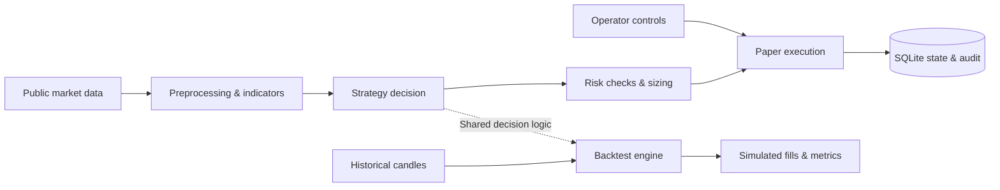

<div align="center">

# NeuronTrade

### Paper trading. Persistent risk controls. Research you can inspect.

A Python engineering portfolio project, published as **Bottrade-v1**.

[](https://github.com/osama-z/bottrade-v1/actions/workflows/ci.yml)


[](LICENSE)

[Architecture](docs/ARCHITECTURE.md) · [Research findings](docs/STRATEGY_NOTES.md) · [Tests](tests/) · [Review notes](docs/PUBLIC_DEMO_REVIEW.md)

</div>

NeuronTrade connects public market data, technical indicators, strategy decisions,
risk checks and simulated execution in a modular Python system. SQLite records
paper positions, balances and risk events so decisions can be inspected and
normal restart behavior can be tested.

> **Public educational demo — paper trading only.** Live and testnet executors
> are disabled and raise `RealMoneyRefused`. This project has **no proven trading
> edge** and is not intended for real-money trading.

## What to look at

| Engineering question | Implementation | Evidence |
| --- | --- | --- |
| How are simulated positions sized and constrained? | [Risk manager](risk/manager.py): Decimal-based sizing, daily-loss/drawdown limits and portfolio heat | [Risk tests](tests/test_risk_manager.py) |
| Can a risk halt survive a normal restart? | SQLite-backed circuit breaker with manual reset | [State recovery tests](tests/test_tier2_state.py) |
| Do research and paper decisions agree? | Shared strategy decision logic and candle-close timing | [Parity tests](tests/test_tier8_parity.py), [shadow alignment tests](tests/test_shadow_parity.py) |
| Can an operator stop the simulation? | Flag-file / signal kill switch and authorized Telegram commands | [Kill-switch tests](tests/test_tier4_killswitch.py) |
| Does a promising backtest survive scrutiny? | Strategy screening, time splits and documented rejected hypotheses | [Research notes](docs/STRATEGY_NOTES.md) |

## Architecture at a glance



The main paper loop decides on closed candles. The backtest engine replays
historical candles; regression tests check shared decision behavior. An optional
ZeroMQ path separates intelligence and paper execution into two processes.

| Package | Responsibility |
| --- | --- |
| `data/`, `indicators/` | Market-data fetching, preprocessing, order-book utilities and indicators |
| `strategies/`, `ai/` | Registered rule-based strategies and optional ML, regime and sentiment research |
| `risk/` | Position sizing, limits, persistent circuit breaker and performance metrics |
| `execution/` | Paper fills, positions, recovery and kill switch; exchange executors are refusal stubs |
| `backtesting/` | Historical simulation, costs and validation helpers |
| `storage/` | SQLite state and audit records; optional storage backends |
| `core/`, `notifications/` | Candle timing, ZeroMQ messaging and optional Telegram controls |

## Quickstart

Use **Python 3.12**. Run commands from the repository root. The default demo uses
SQLite and a rule-based strategy; it needs **no exchange keys or trained models**.

```bash
git clone https://github.com/osama-z/bottrade-v1.git
cd bottrade-v1
python3.12 -m venv .venv
source .venv/bin/activate
python -m pip install -r requirements.lock
cp .env.example .env

# Check local configuration, imports and database without network calls.
python scripts/health_check.py --offline

# Run the paper simulation using public market data. Stop with Ctrl+C.
python scripts/run_live.py
```

On Windows, create the environment with `py -3.12 -m venv .venv`, activate it
with `.venv\Scripts\Activate.ps1`, and copy the config with
`Copy-Item .env.example .env`.

**Paper fills are simulated; market data is real.** The running demo needs
internet access to its data providers. `run_live.py` is the inherited filename
for the paper loop in this repository. Health checks and imports may create
local logs, caches or database files.

### Default example configuration

| Setting | `.env.example` value | Meaning |
| --- | --- | --- |
| `STRATEGY` | `trend_following` | Rule-based baseline; no model training required |
| `DEFAULT_TIMEFRAME` | `4h` | Closed four-hour candles |
| `TRADING_PAIRS` | `ADA/USDT,BTC/USDT,XRP/USDT,LINK/USDT` | Research sample, not investment recommendations |
| `PAPER_TRADING` | `true` | Required; `false` is rejected at configuration load |
| `RISK_PER_TRADE` | `0.02` | Position-sizing risk budget |
| `PORTFOLIO_MAX_HEAT` | `0.06` | Aggregate open stop-distance risk cap |
| `MAX_DRAWDOWN` | `0.10` | Drawdown circuit-breaker threshold |
| `DATABASE_URL` | `sqlite:///storage/neurontrade.db` | SQLite file, resolved relative to the project root |

Exchange credentials are blank in the example and should stay blank for this
demo. Telegram, Groq and news integrations are optional. The `ai_combined`
research strategy needs additional configuration and model preparation; it is
not the quickstart path. See [settings](config/settings.py) for the full options.

## Try the research workflow

Screen one strategy across a small historical sample:

```bash
python scripts/strategy_lab.py --days 365 --pairs BTC/USDT \
  --timeframes 4h --strategies trend_following
```

The lab fetches/caches historical candles and writes a comparison CSV to
`data/cache/strategy_lab_results.csv`. Returns, trade counts, drawdown and Sharpe
are research outputs, not evidence of future profitability.

| Command | Use |
| --- | --- |
| `python scripts/paper_status.py` | Inspect the paper account, positions and breaker state; prices are best-effort |
| `python scripts/health_check.py` | Include external data-service checks |
| `python scripts/run_backtest.py --strategy ma_crossover --pair BTC/USDT --timeframe 4h --days 365` | Run one historical simulation |
| `SHADOW_MODE=true python scripts/run_live.py` | Log decisions without opening paper positions; Bash syntax |

The normal loop waits for candle-close boundaries. Few or zero trades can be
expected when strategy conditions are not met. A tripped breaker remains halted
until an operator resets it; restarting the program does not reset it.

## What the research found

The strongest portfolio result is the validation process: a good-looking
in-sample strategy did not hold up when the data was split.

The [documented July 2026 time-split experiment](docs/STRATEGY_NOTES.md#2d-out-of-sample-confirmation-2026-07-27--the-edge-does-not-survive)
reported these returns for `trend_following`:

| Pair | Older half | Newer half |
| --- | ---: | ---: |
| ADA | +20.1% | −12.1% |
| BTC | +11.9% | −0.9% |
| XRP | +15.2% | −12.4% |
| LINK | +32.3% | −12.5% |

These are recorded historical experiments, **not results rerun for this README**.
The original strategy was selected using the full window, so the split is a
useful robustness diagnostic rather than an untouched holdout proof. Additional
experiments found that short trades drove the candidate's gains; simulated
shorts do not establish viability for an unleveraged spot account.

Read the [research notes](docs/STRATEGY_NOTES.md) for methodology, rejected
signals, caveats and reproduction commands. Downloaded data and trained models
are excluded from Git, so reproducing experiments requires obtaining data.

## Tests and validation

```bash
python -m pytest tests/ -q
python -m pytest tests/ -q --cov
ruff check .
```

The default suite excludes integration tests. It uses synthetic data, mocked
services and temporary databases; some ZeroMQ tests still require local socket
access. GitHub Actions installs pinned dependencies and runs the tests plus a
paper-entrypoint import check. The CI badge reports the published branch's state.

See [review notes](docs/PUBLIC_DEMO_REVIEW.md) for the local review's verified
counts, fixes and validation limits. The review does not claim that the entire
suite passed in every environment.

## Scope and limitations

- **No exchange order execution.** `LiveExecutor` and `TestnetTrader` refuse
  construction; testnet command stubs exit with status 2. `PAPER_TRADING=false`
  is rejected during configuration validation.
- **Simulation is a model.** Fills, fees, slippage and shorts do not reproduce
  every market constraint. Decision parity does not imply identical execution.
- **Decimal calculations have float boundaries.** Some reporting/API paths and
  SQLite monetary columns use floats/`REAL`; persistence is not exact-decimal
  accounting end to end.
- **Trade and cash writes are not atomic together.** A failure between their
  commits can leave persisted account state inconsistent after restart. The
  [review](docs/PUBLIC_DEMO_REVIEW.md#remaining-issues) reproduces this gap.
- **Optional paths need their own setup.** ML models and Postgres/time-series
  services are not bundled or required for the SQLite demo. ClickHouse storage
  is an interface stub, not a working backend.
- **Local validation has limits.** A fresh dependency installation, external
  provider connectivity and a long unattended run were not verified by this review.

## Explore further

- [Project map and command guide](docs/PROJECT_GUIDE.md)
- [Detailed architecture](docs/ARCHITECTURE.md)
- [Research findings and experiment history](docs/STRATEGY_NOTES.md)
- [Backtest/paper parity design](docs/backtest_live_parity_design.md)
- [Paper-run preregistration](docs/paper_run_preregistration.md)
- [Paper deployment and operator controls](deploy/README.md)

Built by [Osama Zuraid](https://github.com/osama-z). Licensed under [MIT](LICENSE). [Third-party license notes](docs/THIRD_PARTY_NOTICES.md).
