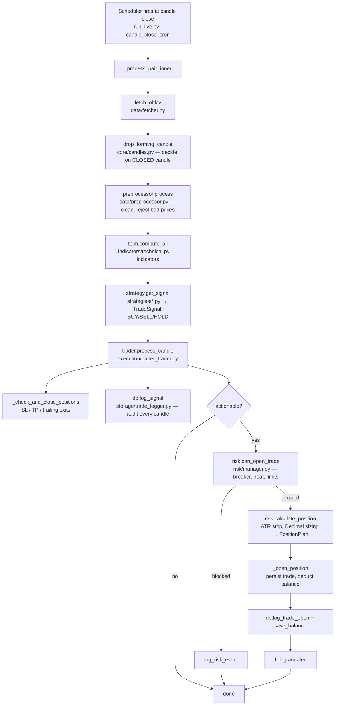

> **Bottrade-v1 public demo:** live/testnet execution is stripped by design. `scripts/run_live.py` is the primary paper simulation loop.

# Architecture

How NeuronTrade is put together, how one trade cycle flows from start to
finish, and how to extend it. Read this before diving into the code.

---

## 1. The big picture — layers & dependency direction

The system is layered. **Dependencies point *inward*** (entry points depend on
services; services depend on core/config; nothing depends on the entry points).
This is what keeps it testable and extensible.

```
┌──────────────────────────────────────────────────────────────┐
│  ENTRY POINTS      scripts/run_live.py (paper only in this demo) │
│  (orchestration)   scripts/run_backtest.py · strategy_lab.py     │
└───────────────┬──────────────────────────────────────────────┘
                │ wires together ↓
┌───────────────┴──────────────────────────────────────────────┐
│  SERVICES                                                     │
│                                                              │
│  data/        →  indicators/  →  strategies/  →  risk/        │
│  (fetch,          (technical,      (decide:         (size,    │
│   clean)           features)        BUY/SELL/HOLD)   guard)   │
│                                        │                      │
│                                        ▼                      │
│                                  execution/                  │
│                          PaperTrader (simulate)              │
│                          LiveExecutor / TestnetTrader: DISABLED │
│                                        │                      │
│                                        ▼                      │
│                                  storage/  (SQLite)          │
│                                                              │
│  notifications/ (Telegram)   core/ (ZMQ, candle timing)      │
└───────────────┬──────────────────────────────────────────────┘
                │ everything reads ↓
┌───────────────┴──────────────────────────────────────────────┐
│  FOUNDATION   config/ (frozen settings, constants, pairs)     │
└──────────────────────────────────────────────────────────────┘
```

| Layer | Package | Responsibility |
|---|---|---|
| Entry points | `scripts/` | Wire components, own the scheduling loop |
| Market data | `data/` | Fetch OHLCV (ccxt), clean, order-book sync |
| Indicators | `indicators/` | Technical indicators, ML feature engineering |
| Strategy | `strategies/` | Turn indicators into a BUY / SELL / HOLD decision |
| Risk | `risk/` | Position sizing, circuit breaker, metrics, walk-forward |
| Execution | `execution/` | Simulate paper orders and manage positions; exchange executors disabled |
| Storage | `storage/` | SQLite persistence (trades, signals, orders, state) |
| AI | `ai/` | XGBoost predictor, HMM regime, LLM/sentiment (measured, mostly dropped) |
| Backtesting | `backtesting/` | Parity-verified engine over historical data |
| Core | `core/` | ZMQ pub/sub, candle-close timing helpers |
| Notifications | `notifications/` | Telegram control + alerts |
| Foundation | `config/` | Single source of truth for all configuration |

---

## 2. Entry points — where execution starts

| Command | File | Does |
|---|---|---|
| `python scripts/run_live.py` | `scripts/run_live.py` | **Paper** trading (simulated fills), the main loop |
| `python scripts/run_testnet.py` | `scripts/run_testnet.py` | Disabled; exits with status 2 |
| `python scripts/run_backtest.py` | `scripts/run_backtest.py` | One backtest over history |
| `python scripts/strategy_lab.py` | `scripts/strategy_lab.py` | Screen strategies × pairs × timeframes |
| `python scripts/health_check.py` | `scripts/health_check.py` | Pre-flight checks |
| `python scripts/paper_status.py` | `scripts/paper_status.py` | One-page live status |

The paper loop follows this shape: a scheduler fires **once per candle
close** (UTC-aligned), runs the pipeline for each pair, and sleeps.

---

## 3. End-to-end flow — one trade cycle, start → done



### The same cycle, traced through the actual code

Start in **`scripts/run_live.py`**:

1. **`start()`** schedules `_process_pair` for each pair via
   `candle_close_cron(timeframe)` — fires a few seconds after each UTC candle
   close (so live acts on the same *closed* candle the backtest scored).
2. **`_process_pair` → `_process_pair_inner`** runs the pipeline under a
   per-cycle correlation ID (traceable end-to-end in logs & DB):
   - `fetcher.fetch_ohlcv(pair, tf, limit=500)` — `data/fetcher.py`
   - `drop_forming_candle(df, tf)` — `core/candles.py` (drop the still-forming candle)
   - `preprocessor.process(df)` — `data/preprocessor.py` (dedupe, sort, bounded
     ffill, reject non-positive prices)
   - `tech.compute_all(df)` — `indicators/technical.py` (RSI, MACD, Supertrend,
     ADX, ATR, …)
   - `strategy.get_signal(df, pair)` — `strategies/…` → a `TradeSignal`
   - `trader.process_candle(df, pair, ai_signal, corr)` — hands off to execution
3. **`execution/paper_trader.py: process_candle`** is where money logic lives:
   - stale-data guard → `_check_and_close_positions(...)` (exits first)
   - `db.log_signal(...)` — every candle is audited, even HOLD
   - if actionable: `risk.can_open_trade(...)` → `risk.calculate_position(...)`
     → `_open_position(plan, …)` → `db.log_trade_open(...)` + `save_balance(...)`
4. **Done** — record market structure, check drawdown, log latency. Sleep until
   the next candle close.

### Exchange execution is disabled

`LiveExecutor` and `TestnetTrader` are refusal stubs in this public demo.
Their constructors raise `RealMoneyRefused`; `run_testnet.py` exits with status 2.
Only the paper simulation is supported here.

---

## 4. Extending the system (built to scale)

The architecture is designed so common changes touch **one place**:

- **Add a strategy** → create a class implementing `BaseStrategy`
  (`generate_signals`, `get_signal`, `get_params`) in `strategies/`, register it
  in `strategies/registry.py`. Select it with `STRATEGY=<name>` in `.env`.
  *Nothing else changes* — the live loop is strategy-agnostic.
- **Add an indicator** → add it in `indicators/technical.py` (always create the
  column, even NaN on short frames — see the `_ma_or_nan` pattern).
- **Add a data source / exchange** → `data/fetcher.py` uses ccxt; swap
  `ccxt.binance` for any of ~100 exchanges, or add a method.
- **Change risk rules** → `risk/manager.py` (`RiskConfig` is the single
  settings-derived config both live and backtest use — parity by construction).
- **Change configuration** → `config/settings.py` only. Frozen pydantic
  settings; risk-relevant values have range constraints and an `.env` alias.

### Design decisions that make it maintainable
- **Backtest/live parity** — the same decision path runs in both, pinned by
  golden-file tests, so a strategy is validated as the thing that actually runs.
- **Dependency injection** — traders take their collaborators (executor, db,
  risk) as constructor args → trivially testable with fakes (see `tests/`).
- **Registry pattern** — strategies are swappable by name, no code edits.
- **Decimal risk and paper calculations** — some API/reporting boundaries and
  SQLite monetary columns still use floats/REAL; this is not an end-to-end
  exact-decimal persistence guarantee.
- **Single config source** — no hardcoded thresholds scattered across modules.

---

## 5. Where to start reading the code
1. `scripts/run_live.py` — the orchestration loop (this doc's §3)
2. `execution/paper_trader.py` — where a trade is actually made
3. `risk/manager.py` — sizing + the circuit breaker
4. `strategies/trend_following.py` — a complete, simple strategy
5. `backtesting/engine.py` — how the same logic is validated on history

*Companion docs: `README.md` (overview), `docs/STRATEGY_NOTES.md` (measured
results & why the strategy has no edge).*
